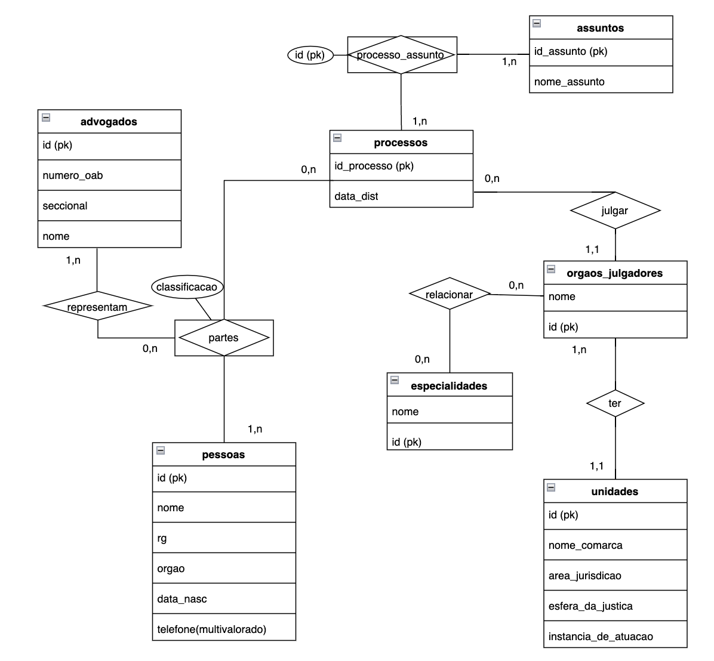
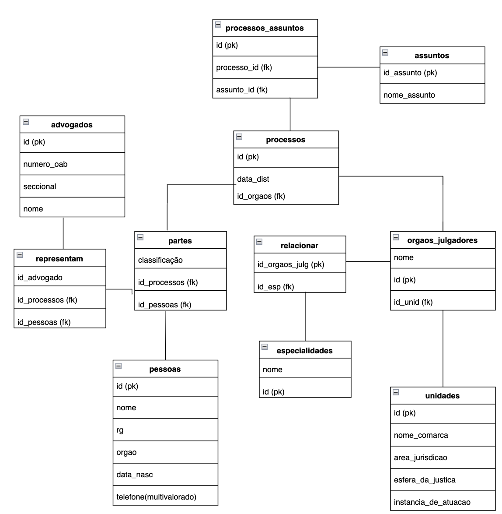

# Desafio 5 - SouJud

# Modelo Entidade - Relacionamento (MER)



# Modelo Lógico



# Modelo Físico - CRUD

## Create - Criando as tabelas no banco 

### Tabela advogados

```
CREATE TABLE IF NOT EXISTS advogados
(
	id serial,
	numero_oab int not null,
	seccional varchar(11) not null,
	nome varchar(200) not null,
	constraint advogados_pk primary key (id),
	constraint advogados_oab_seccional_pk unique (numero_oab, seccional)
)
```

### Tabela pessoas

```
CREATE TABLE IF NOT EXISTS pessoas
(
	id serial,
	nome varchar(200) not null,	
	rg int not null,
	orgao varchar(10) not null,
	data_nasc date not null,
	telefone varchar(15),
	constraint pessoas_id primary key (id),
	constraint pessoas_rg_orgao_pk unique (rg, orgao)
)
```

### Tabela unidades

```
CREATE TABLE IF NOT EXISTS unidades
(
	id serial,
	nome_comarca varchar(200) not null,
	area_jurisdicao varchar(200) not null,
	esfera_da_justica varchar(200) not null,
	instancia_de_atuacao smallint not null,
	constraint unidades_pk primary key (id)
)
```

### Tabela orgaos_julgadores

```
CREATE TABLE IF NOT EXISTS orgaos_julgadores
(
	nome varchar(200) not null,
	id int not null,
	id_unid int not null,
	constraint orgaos_julgadores_pk primary key (id),
	constraint orgaos_julgadores_fk foreign key (id_unid) references unidades (id)
)
```

### Tabela especialidades

```
CREATE TABLE IF NOT EXISTS especialidades
(
	nome varchar(200) not null,
	id int not null,
	constraint especialidades_pk primary key (id)
)
```

### Tabela relacionar

```
CREATE TABLE IF NOT EXISTS relacionar
(
	id_orgaos_julg int not null,
	id_espec int not null,
	constraint relacionar_id_orgaos_julg_fk foreign key (id_orgaos_julg) references orgaos_julgadores (id),
	constraint relacionar_id_espec_fk foreign key (id_espec) references especialidades (id)
)
```

### Tabela processos

```
CREATE TABLE IF NOT EXISTS processos
(
	id smallint not null,
	data_dist date not null,
	id_orgaos_juld int not null,
	constraint processos_pk primary key (id),
	constraint processos_fk foreign key (id_orgaos_juld) references orgaos_julgadores (id)
)
```

### Tabela assuntos

```
CREATE TABLE IF NOT EXISTS assuntos
(
	id_assunto smallint not null,
	nome_assunto varchar(250) not null,
	constraint assuntos_pk primary key (id_assunto)
)
```

### Tabela processos_assuntos

```
CREATE TABLE IF NOT EXISTS processos_assuntos
(
	id smallint not null,
	processo_id smallint not null,
	asssunto_id smallint not null,
	constraint ps_pk primary key (id),
	constraint ps_processo_id_fk foreign key (processo_id) references processos (id),
	constraint ps_asssunto_id_fk foreign key (asssunto_id) references assuntos (id_assunto)
)
```

### Tabela partes

```
CREATE TABLE IF NOT EXISTS partes
(
	classificacao varchar(100) not null,
	id_processos smallint not null,
	id_pessoas smallint not null,
	constraint partes_id_processo_fk foreign key (id_processos) references processos (id),
	constraint partes_id_pessoas_fk foreign key (id_pessoas) references pessoas (id)
)
```

### Tabela representam

```
CREATE TABLE IF NOT EXISTS representam
(
	id_advogado int not null,
	id_processos smallint not null,
	id_pessoas smallint not null,
	constraint representam_id_adv_fk foreign key (id_advogado) references advogados (id),
	constraint representam_id_processo_fk foreign key (id_processos) references processos (id),
	constraint representam_id_pessoas_fk foreign key (id_pessoas) references pessoas (id)
)
```

## Populando as tabelas com INSERT INTO

### Tabela advogados

```
INSERT INTO advogados (numero_oab, seccional, nome)
VALUES
(12345678, 'OAB-BA', 'Bruno Marques'),
(13254678, 'OAB-PE', 'Manoel Nascimento'),
(32154678, 'OAB-SP', 'Ana Silva'),
(93254678, 'OAB-RJ', 'Manoela Costa'),
(23274678, 'OAB-AL', 'Patricia Nascimento')
```

### Tabela pessoas

```
INSERT INTO pessoas (nome, rg, orgao, data_nasc, telefone)
VALUES
('Carla Cristina Silva', '2427331', 'SDS-BA', '1982-03-27', '994708534'),
('Pedro Cavalcanti', '3127331', 'SSP-PE', '1986-02-03', '998708224'),
('Bianca Silva', '1427333', 'SDS-SP','1978-10-22', '988708224'),
('Paulo Alves', '1125331', 'SSP-RJ','1972-12-26', '984703324'),
('Ronaldo Barbosa', '0527337', 'SDS-AL', '1985-11-16', '946703329')
```

### Tabela unidades

```
INSERT INTO unidades (nome_comarca, area_jurisdicao, esfera_da_justica, instancia_de_atuacao)
VALUES
('Comarca de Salvador', 'Salvador-BA', 'Justiça Federal', 2),
('Comarca de Recife', 'Recife-PE', 'Justiça do Trabalho', 1),
('Comarca de São Paulo', 'São Paulo-SP', 'Justiça Eleitoral', 2),
('Comarca do Rio de Janeiro', 'Rio de Janeiro-RJ', 'Justiça Militar', 2),
('Comarca de Maceió', 'Maceió-AL', 'Justiça Estadual', 1)
```

### Tabela orgaos_julgadores

```
INSERT INTO orgaos_julgadores (nome, id, id_unid)
VALUES
('1ª vara criminal', 1, 1),
('1ª vara do trabalho', 2, 2),
('Tribunal Regional Eleitoral', 3, 3),
('2ª vara civel', 4, 4),
('2ª vara da Família', 5, 5)
```

### Tabela especialidades

```
INSERT INTO especialidades (nome, id)
VALUES
('Direito Criminal', 1),
('Direito trabalhista', 2),
('Direito Eleitoral', 3),
('Direito civil', 4),
('Direito da Família', 5)
```

### Tabela relacionar

```
INSERT INTO relacionar (id_orgaos_julg, id_espec)
VALUES
(1, 1),
(2, 2),
(3, 3),
(4, 4),
(5, 5)
```

### Tabela processos

```
INSERT INTO processos (id, data_dist, id_orgaos_juld)
VALUES
(123, '2023-02-12', 1),
(125, '2022-12-22', 2),
(347, '2023-04-15', 3),
(145, '2021-06-04', 4),
(199, '2023-01-14', 5)
```

### Tabela assuntos

```
INSERT INTO assuntos (id_assunto, nome_assunto)
VALUES
(1, 'crime por assassinato'),
(2, 'assédio'),
(3, 'corrupção'),
(4, 'furto'),
(5, 'não pagamento de pensão alimentícia')
```

### Tabela processos_assuntos

```
INSERT INTO processos_assuntos (id, processo_id, asssunto_id)
VALUES
(1, 123, 1),
(2, 125, 2),
(3, 347, 3),
(4, 145, 4),
(5, 199, 5)
```

### Tabela partes

```
INSERT INTO partes (classificacao, id_processos, id_pessoas)
VALUES
('réu', 123, 1),
('réu', 125, 2),
('réu', 347, 3),
('réu', 145, 4),
('réu', 199, 5)
```

### Tabela representam

```
INSERT INTO representam (id_advogado, id_processos, id_pessoas)
VALUES
(1, 123, 1),
(2, 125, 2),
(3, 347, 3),
(4, 145, 4),
(5, 199, 5)
```

## Read - Fazendo leitura nas tabelas

### Tabela advogados

```
SELECT nome, numero_oab from advogados where SUBSTRING(seccional, 5) = 'PE'
```

### Tabela pessoas

```
SELECT nome, telefone from pessoas where DATE_PART('year', AGE(CURRENT_DATE, data_nasc)) > 40
```

## Update - Atualizando as tabelas no banco 

### Tabela pessoas

```
UPDATE pessoas SET telefone = SUBSTRING (telefone, 1, 5) || '-' || SUBSTRING (telefone, 6)
```

## Delete - Excluindo  dados nas tabelas  

### Tabela pessoas

```
DELETE from pessoas where id = 6
```


